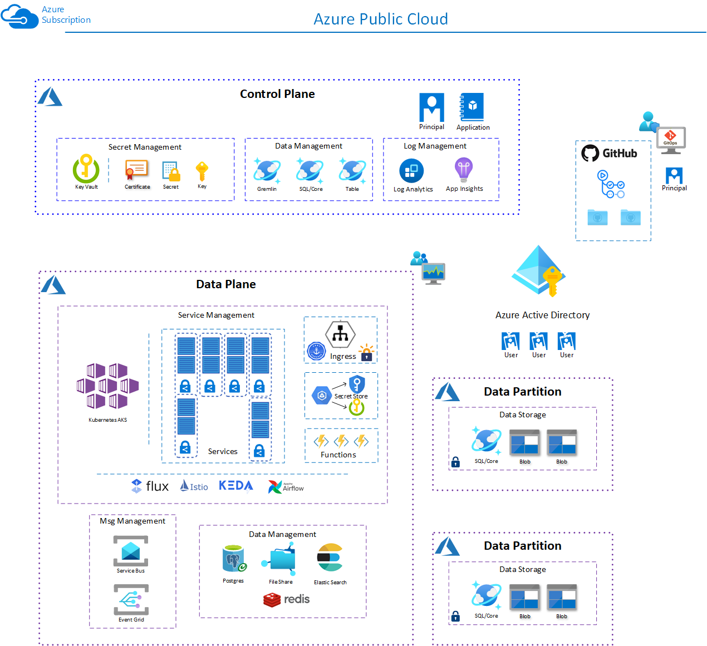

# Self Managed OSDU

[](https://github.com/danielscholl/self-managed-osdu/actions/workflows/secret-generator.yaml)

[](https://github.com/danielscholl/self-managed-osdu/actions/workflows/env-builder.yaml)

This project is a prototype developed to deploy [OSDU on Azure](https://community.opengroup.org/osdu/platform/deployment-and-operations/infra-azure-provisioning) on self managed infrastructure.



## Initialize the project

The solution is designed to operate from a fork instance of the project.

1. Fork the Project into your own GitHub Account.


## Configure GitHub Secrets

1. `GH_REPO_TOKEN`: A personal access token with `repo` scope.

A Personal Access Token with `repo` scope is used by the Github Actions to configure additional Github Secrets into the Forked Repository.


2. `AZURE_LOCATION`: The Azure Region to deploy the resources to.


3. `AZURE_CREDENTIALS`: The Azure Service Principal's json output.

A Service Principal is used as the identity to deploy resources into Azure.

> Subscription Owner Scope is required due to the assignment of Roles.

```bash
SUBSCRIPTION_ID=$(az account show --query id --output tsv)

az ad sp create-for-rbac --name "osdu-azure-credentials" \
  --role "Owner" \
  --scopes /subscriptions/$SUBSCRIPTION_ID \
  --sdk-auth \
  -ojson


# Sample Format
{
  "clientId": "00000000-0000-0000-0000-000000000000",                       # Client ID GUID
  "clientSecret": "**********************************",                     # Client Secret
  "subscriptionId": "00000000-0000-0000-0000-000000000000",                 # Subscription ID GUID
  "tenantId": "00000000-0000-0000-0000-000000000000",                       # Tenant ID GUID
  "activeDirectoryEndpointUrl": "https://login.microsoftonline.com",
  "resourceManagerEndpointUrl": "https://management.azure.com/",
  "activeDirectoryGraphResourceId": "https://graph.windows.net/",
  "sqlManagementEndpointUrl": "https://management.core.windows.net:8443/",
  "galleryEndpointUrl": "https://gallery.azure.com/",
  "managementEndpointUrl": "https://management.core.windows.net/"
}
```


3. `OSDU_CREDENTIALS`: The OSDU Environment Service Principal's json output.

```bash
SUBSCRIPTION_ID=$(az account show --query id --output tsv)

az ad sp create-for-rbac --name "osdu-credentials" \
  --role "Contributor" \
  --scopes /subscriptions/$SUBSCRIPTION_ID \
  --sdk-auth \
  -ojson


# Sample Format
{
  "clientId": "00000000-0000-0000-0000-000000000000",                       # Client ID GUID
  "clientSecret": "**********************************",                     # Client Secret
  "subscriptionId": "00000000-0000-0000-0000-000000000000",                 # Subscription ID GUID
  "tenantId": "00000000-0000-0000-0000-000000000000",                       # Tenant ID GUID
  "activeDirectoryEndpointUrl": "https://login.microsoftonline.com",
  "resourceManagerEndpointUrl": "https://management.azure.com/",
  "activeDirectoryGraphResourceId": "https://graph.windows.net/",
  "sqlManagementEndpointUrl": "https://management.core.windows.net:8443/",
  "galleryEndpointUrl": "https://gallery.azure.com/",
  "managementEndpointUrl": "https://management.core.windows.net/"
}
```

4. `OSDU_CREDENTIAL_OID`: The OSDU Environment Service Principal's object id.

> The object id is necessary to be retrieved as the AZURE_CREDENTIALS access level is not enough to retrieve the access token automatically.

```bash
az ad sp list --display-name "osdu-credentials" --query [].objectId -otsv
```

5. `OSDU_APPLICATION`: The OSDU Environment Application json output

```bash
az ad app create --display-name "osdu-application" \
  --available-to-other-tenants true  \
  --query '{appId:appId, displayName:displayName, objectId:objectId}' \
  -ojson

  # Sample Format
  {
  "appId": "00000000-0000-0000-0000-000000000000",
  "displayName": "osdu-application",
  "objectId": "00000000-0000-0000-0000-000000000000"
}
```

6. `ELASTIC_ENDPOINT`: The endpoint of the Elasticsearch cluster. 

```bash
# Sample Format
https://my-osdu.es.southcentralus.azure.elastic-cloud.com:9243
```

7. `ELASTIC_PASSWORD`: The password of the Elasticsearch cluster.


## Execute Github Actions

Deployment is performed by executing the following Github Actions:

1. Generate Secrets: This action creates additional Github Secrets into the Forked Repository.

2. Prepare Builder: This action deploys the builder resources into an Azure Subscription.
